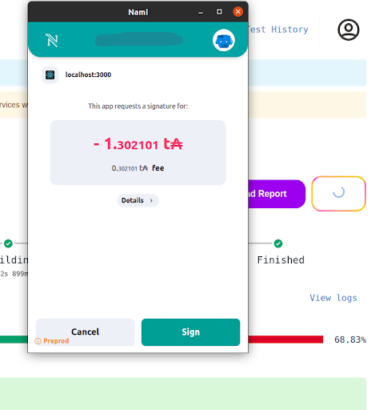

# Getting a certificate
After a successful testing campaign, you will have the possibility to generate a certificate for your DApp. You will be prompted by a pop-up that displays the on-chain and the off-chain certificate. 

:::tip
At this point, no information has been broadcasted on or off-chain. All IPFS links have only been pre-computed and do not exist yet.
:::

It’s important to review correctly the certification information, as this will be used by third-party DApp aggregators and DApp store to link certification to DApps.

:::caution
Carefully check that the subject name is the same as the one used for Registration Certificate (see CIP-72 for more information).
Carefully check that the computed set of scripts and script hashes matches the ones that will be deployed and declared in registration.
:::

After agreeing that all the information is correct, the user can now purchase the certificate.

## Paying for the certificate
The user will be required to send a transaction payment to their individual payment address to purchase the certificate. 

## Viewing the certificate
--- THIS SECTION WILL BE REMOVED FOR NOW ---

The certificate is broadcasted on the chain through IOG's certficate broadcaster wallet. The user will be presented with a pop-up and the link to the transaction with the certificate metadata

:::caution
The transaction needs some time before appearing on the blockchain. If the transaction does not appear after 30 minutes, please contact the support.
:::

