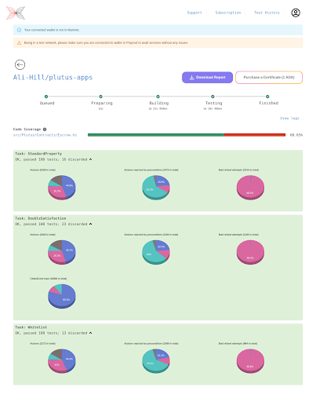
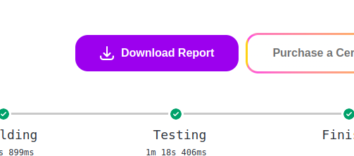

# Result page
The result page will present all the testing results.

In this section, we will detail the different metrics and results

## Coverage

[INSERT SCREENSHOT OF JUST THE COVERAGE PART]
Coverage measures the number of lines of your source code that were tested. You can click on the link to see a more detailed and comprehensive coverage report.
[EXPLAIN THE COLOURS WITH EXAMPLES]

## Property based Testing results

[EXPLAIN]

## Report

You can download a JSON version of the report by clicking on “Download Report” button.

The report contains all the information provided in the Result Page as a JSON. This report will be included in the off-chain metadata of a certificate if the testing was successful and all the necessary KPI were met.

## What to do if positive

If the testing is positive, Plutus Testing Tool will allow the user to purchase a certificate. This certificate will attest that [INSERT WHATEVER LEGAL ALLOWS US TO SAY].
See Section Getting a certificate for more details
If the user chooses to not get a certificate at this point, they can always do it from the Testing history page (See section Testing history)

## What to do if negative

If the testing is negative, you will see the reasons why the testing has failed. Plutus Testing Tool will not allow the user to purchase a certificate. However, the user is free to send the testing results as a Level 0 testing result on-chain. 

You will not have the ability to generate a certificate. Before being able to get certified, the User will need to review their code and testing and fix all the issues listed in the report.
