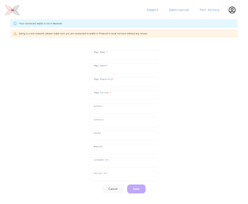

# Filling up the user-profile
[TO REDO WITH THE NEW USER PROFILE PAGE]

## As a developer

For the moment, Plutus Testing Tool is only available for pre-approved auditors.

Our tool will be available soon to all developers.

## As an auditor

After connecting to the tool, you have to review an NDA[LINK?] that needs to be accepted to continue with the tool.

Upon signing into the tool, you will have to fill in the mandatory details for your profile.
[SCREENSHOT]
