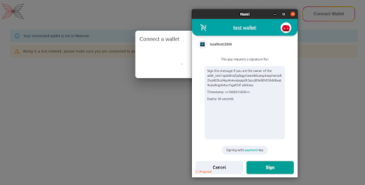

# Signing-up for the tool

Your access to the tool is linked to a Cardano wallet.
Signing up for the tool requires having a Nami, Yoroi, or Lace wallet.
First, you need to ensure that you are connected to your wallet. 

:::danger
Note: An account is linked to a specific wallet. 

Losing access to the wallet will lose access to your account, subscription, testing history, certificate history.
:::

Login into your wallet using the Connect button as shown below
[SCREENSHOT]

Clicking on Connect Wallet, you will be presented with the wallets installed within your browser that can be connected to our tool. Click on the appropriate wallet card to continue to the tool. 

At this point, you will see a popup within the wallet extension asking you to Sign a message with a timestamp for an additional layer of security over the connected wallet. You will have to Sign this within a 60 seconds timeout, which once expired have to Connect to the wallet again.

