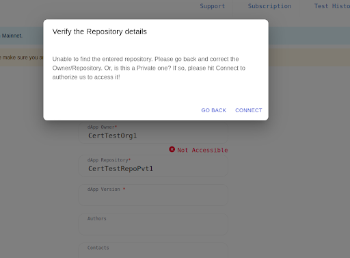
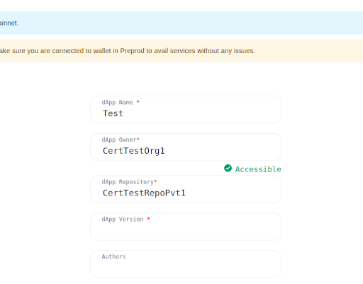

# Launching a testing campaign
## Logging-in for private repos

The tool automatically checks that it can access the repository. This is immediate if the repository is public. If you are using a private repository, you will need to grant the tool access to it.

You will be redirected to GitHub to grant access, upon clicking CONNECT.

:::tip

Plutus Testing Tool will never modify, fork, or reuse any of the information in your private repository. It will only be accessed for testing and certification purposes.

:::

After granting access to the repository, you will see the confirmation that the tool has been configured correctly.

## Picking a checkout
Certification is only valid for a particular version of your DApp. When entering the testing tool, you are prompted with the following screen:
[SCREENSHOT OF THE GITHUB REPO PROMPT]

You need to enter the hash of the commit hash of the version of your DApp you want to test and certify. This hash can be found in GitHub as seen on the following screenshot:

If no checkout is provided, Plutus Testing Tool will assume that the latest checkout will be tested.

## Testing
If the repository is correctly prepared for testing and certification (See Section ?? on how to do that), Plutus Testing Tool will start the testing session.

Plutus Testing Tool will start by preparing the DApp for testing, build it according to the nix file for certification, and will then enter the testing phase. Upon completion, a complete testing report will be displayed.

## Aborting a run
A User can abort a run by simply clicking on the Abort Run button. 
Doing so
